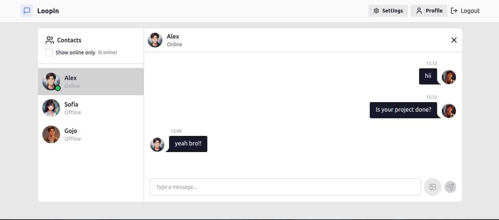
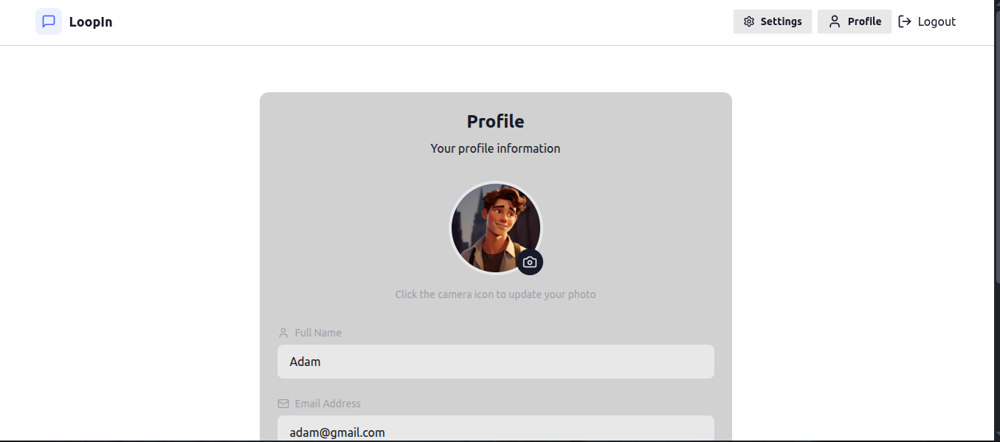
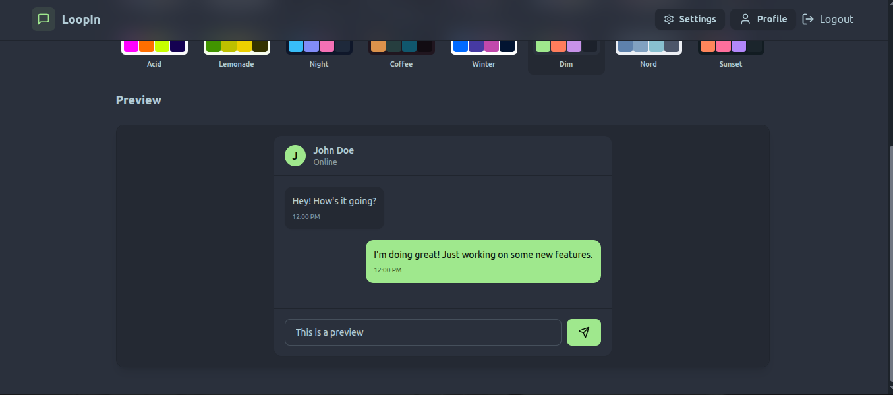
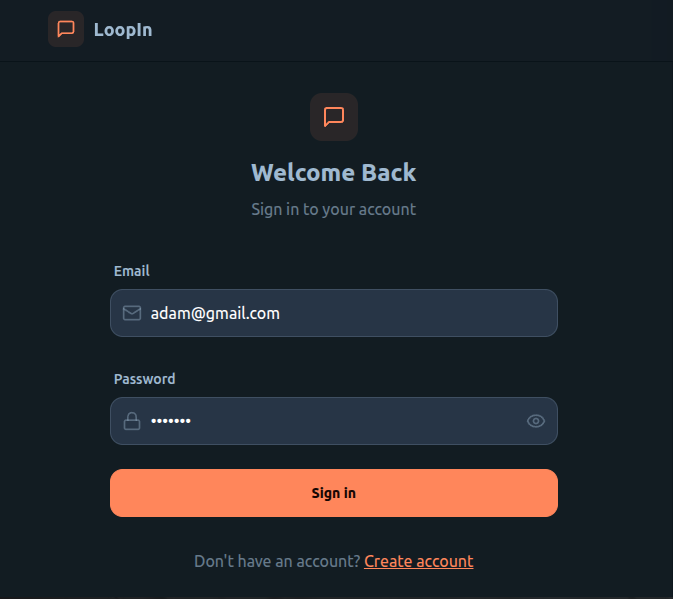
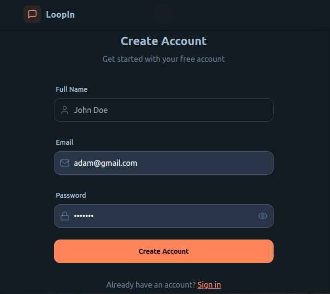

# Loopin

Loopin is a modern, real-time chat application that lets you connect with friends, share messages, and update profile pictures easily. It’s designed to be simple, responsive, and fast.

---

## Features

- User registration and login with JWT authentication
- Real-time messaging
- Upload and update profile pictures
- Responsive design for desktop and mobile
- Secure backend with protected routes

---

## Tech Stack

- Frontend: React, Vite, Tailwind CSS (or your chosen CSS framework)
- Backend: Node.js, Express
- Database: MongoDB
- Authentication: JWT
- Cloud Storage: Cloudinary (for profile pictures)

---

## Getting Started

### Prerequisites

- Node.js installed
- MongoDB account or Atlas cluster
- Cloudinary account for profile picture uploads

### Installation

1. Clone the repository:

git clone https://github.com/Urmila-Tentu/loopin-chat-app.git

2. Install backend dependencies:

cd backend
npm install

3. Install frontend dependencies:

cd ../frontend
npm install

4. Create a `.env` file in the backend folder with these variables:

PORT=5001
MONGO_URI=your_mongodb_connection_string
JWT_SECRET=your_jwt_secret
CLOUDINARY_CLOUD_NAME=your_cloud_name
CLOUDINARY_API_KEY=your_api_key
CLOUDINARY_API_SECRET=your_api_secret

---

### Running the App

- Backend:

cd backend
npm start

- Frontend:

cd frontend
npm run dev

Open your browser at http://localhost:5173 to start using Loopin.

---

## Screenshots

### Chat Window

---

## License

This project is for learning and personal use.
